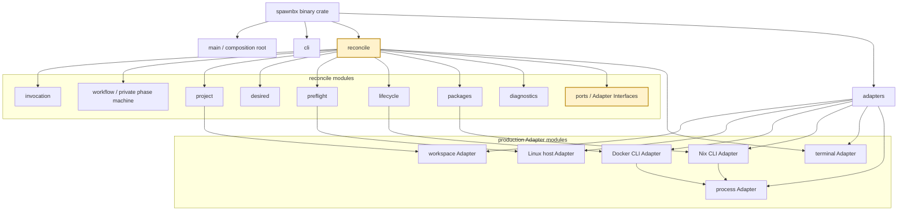
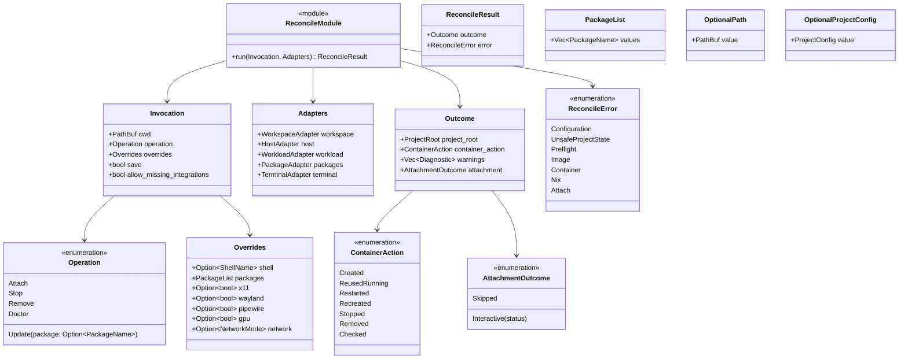
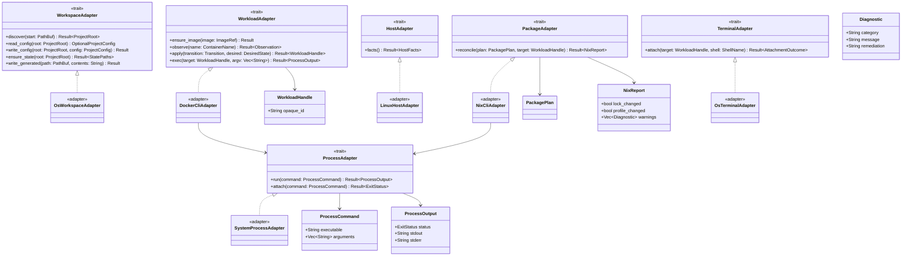
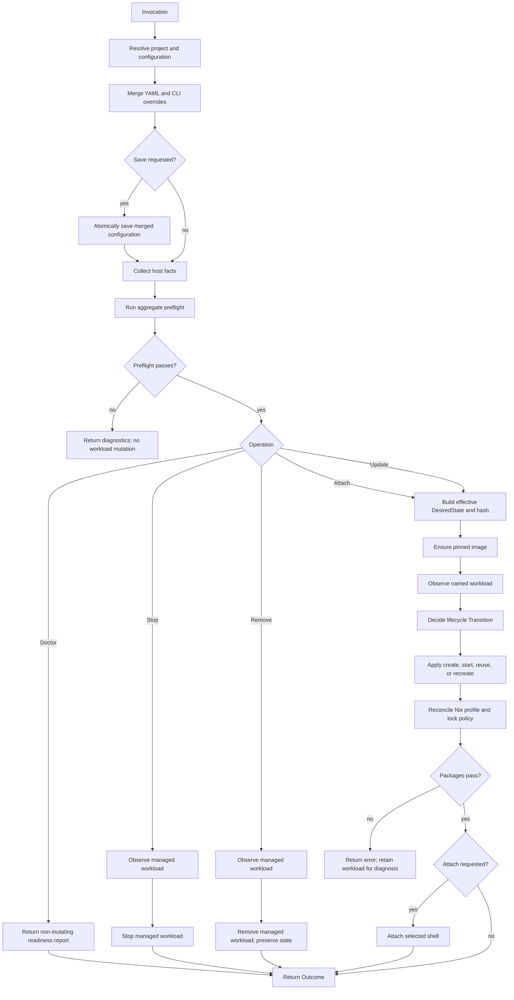

# spawnbx Architecture View

This is the implementation map for the approved design. It describes the
planned Rust crate, modules, structs, enums, traits, properties, and methods.
It is a design inventory, not an assertion that these types already exist.

The current repository has one binary crate. The scaffold package is named
`spawnbx_reroll`; the intended product and binary name is `spawnbx`. The
design does not currently justify splitting the project into multiple crates.

## Crate And Module Graph

## Caller-Facing Interface

`reconcile::run` is the only orchestration Interface exposed to the command
layer. The command layer builds an `Invocation`, supplies `Adapters`, and
renders the returned `Outcome` or `ReconcileError`.

## Domain Structs And Pure Modules

These modules contain policy and pure decisions. They do not expose Docker or
Nix command syntax to callers.

```mermaid
classDiagram
    class ProjectModule {
        <<module>>
        +resolve(start: PathBuf, WorkspaceAdapter) Result~ProjectContext~
        +merge(ProjectConfig, Overrides) Result~EffectiveConfig~
        +save(ProjectRoot, EffectiveConfig, WorkspaceAdapter) Result
    }

    class ProjectContext {
        +ProjectRoot root
        +OptionalPath config_path
        +EffectiveConfig config
        +StatePaths state_paths
    }

    class ProjectConfig {
        +Option~String~ name
        +Option~ShellName~ shell
        +PackageList packages
        +IntegrationRequests integrations
        +Option~NetworkMode~ network
    }

    class IntegrationRequests {
        +Option~bool~ x11
        +Option~bool~ wayland
        +Option~bool~ pipewire
        +Option~bool~ gpu
    }

    class EffectiveConfig {
        +Option~String~ name
        +ShellName shell
        +Vec~PackageName~ packages
        +IntegrationRequests integrations
        +NetworkMode network
    }

    class StatePaths {
        +PathBuf state_dir
        +PathBuf home_dir
        +PathBuf nix_dir
        +PathBuf lock_path
    }

    class DesiredModule {
        <<module>>
        +build(ProjectContext, HostFacts, CapabilityGrants) Result~DesiredState~
    }

    class DesiredState {
        +ContainerSpec container
        +PackageIntent packages
        +CapabilityGrants integrations
        +SpecHash hash
    }

    class ContainerSpec {
        +ImageRef image
        +ContainerName name
        +HostIdentity identity
        +MountSet mounts
        +ShellName shell
        +NetworkMode network
        +CapabilityGrants integrations
        +ManagedLabels labels
    }

    class PreflightModule {
        <<module>>
        +evaluate(EffectiveConfig, HostFacts, PreflightPolicy) Result~PreflightResult~
    }

    class PreflightResult {
        +HostFacts facts
        +CapabilityGrants effective_grants
        +Vec~Diagnostic~ warnings
    }

    class PreflightPolicy {
        +bool allow_missing_integrations
        +bool prefer_rootless
    }

    class LifecycleModule {
        <<module>>
        +decide(DesiredState, Observation) Result~Transition~
    }

    class Observation {
        +ContainerName name
        +bool managed
        +bool running
        +SpecHash observed_hash
        +ImageRef observed_image
        +ManagedLabels labels
    }

    class Transition {
        <<enumeration>>
        Create
        Reuse
        Start
        Recreate
        Collision
        Noop
    }

    class PackagesModule {
        <<module>>
        +plan(PackageIntent, LockPolicy, StatePaths) Result~PackagePlan~
    }

    class PackageIntent {
        +Vec~PackageName~ attributes
        +LockPolicy lock_policy
    }

    class PackagePlan {
        +PathBuf generated_metadata
        +PathBuf lock_path
        +PathBuf profile_path
        +LockPolicy lock_policy
        +Option~PackageName~ focus
    }

    class LockPolicy {
        <<enumeration>>
        RespectExisting
        Advance
    }

    ProjectModule --> ProjectContext
    ProjectModule --> ProjectConfig
    ProjectContext --> EffectiveConfig
    ProjectContext --> StatePaths
    DesiredModule --> DesiredState
    DesiredState --> ContainerSpec
    DesiredState --> PackageIntent
    DesiredState --> PreflightResult
    PreflightModule --> PreflightResult
    PreflightModule --> PreflightPolicy
    PreflightResult --> HostFacts
    PreflightResult --> CapabilityGrants
    LifecycleModule --> Observation
    LifecycleModule --> Transition
    PackagesModule --> PackagePlan
    PackagePlan --> PackageIntent
    PackagePlan --> LockPolicy
```

## Value Types And Host Capabilities

Value types prevent raw strings and paths from leaking across the internal
Seams. Their implementations validate invariants at construction time.

```mermaid
classDiagram
    class ProjectRoot {
        +PathBuf canonical_path
    }

    class ContainerName {
        +String value
    }

    class ImageRef {
        +String repository
        +String digest
        +Platform platform
    }

    class HostIdentity {
        +u32 uid
        +u32 gid
        +Vec~u32~ supplementary_groups
    }

    class ShellName {
        +String executable
    }

    class PackageName {
        +String attribute_path
    }

    class SpecHash {
        +String lowercase_hex
    }

    class HostFacts {
        +Platform platform
        +DockerMode docker_mode
        +HostIdentity identity
        +EnvironmentFacts environment
        +SocketFacts sockets
        +DeviceFacts devices
    }

    class CapabilityRequest {
        +IntegrationId id
        +bool requested
    }

    class CapabilityGrant {
        +IntegrationId id
        +Vec~Mount~ mounts
        +Vec~EnvironmentValue~ environment
        +Vec~DeviceGrant~ devices
        +Vec~u32~ groups
    }

    class IntegrationId {
        <<enumeration>>
        X11
        Wayland
        PipeWire
        Gpu
    }

    class CapabilityGrants {
        +Vec~CapabilityGrant~ values
    }

    class NetworkMode {
        <<enumeration>>
        Bridge
        None
    }

    class DockerMode {
        <<enumeration>>
        Rootless
        Rootful
    }

    class Platform {
        +String os
        +String architecture
    }

    class MountSet {
        +Vec~Mount~ values
    }

    class Mount {
        +PathBuf host_path
        +PathBuf container_path
        +bool read_only
    }

    class ManagedLabels {
        +String project_identity
        +SpecHash desired_hash
        +String image_digest
        +u32 schema_version
    }

    class DeviceGrant {
        +PathBuf host_path
        +PathBuf container_path
    }

    class EnvironmentValue {
        +String name
        +String value
    }

    class EnvironmentFacts {
        +String display
        +String wayland_display
        +String pipewire_remote
    }

    class SocketFacts {
        +Vec~PathBuf~ paths
    }

    class DeviceFacts {
        +Vec~PathBuf~ render_nodes
        +bool nvidia_toolkit
    }

    DesiredState --> ProjectRoot
    ContainerSpec --> ContainerName
    ContainerSpec --> ImageRef
    ContainerSpec --> HostIdentity
    ContainerSpec --> ShellName
    PackageIntent --> PackageName
    DesiredState --> SpecHash
    HostFacts --> HostIdentity
    CapabilityRequest --> IntegrationId
    CapabilityGrant --> IntegrationId
    CapabilityGrants --> CapabilityGrant
    ContainerSpec --> MountSet
    ContainerSpec --> ManagedLabels
    CapabilityGrant --> Mount
    CapabilityGrant --> EnvironmentValue
    CapabilityGrant --> DeviceGrant
    HostFacts --> EnvironmentFacts
    HostFacts --> SocketFacts
    HostFacts --> DeviceFacts
```

## Adapter Interfaces

Each Adapter has a production implementation and a fake or recording
implementation. The Adapter Interface is the test Seam; callers do not need
to know whether the implementation uses a real filesystem, Docker CLI, Nix
CLI, or terminal.

## Reconciliation Flow

## Design Rules

- `reconcile::run` is the only caller-facing orchestration Interface.
- Pure policy modules decide; Adapters perform host and executable effects.
- The lifecycle module decides transitions; the Docker Adapter owns Docker
  flags and command ordering for a selected transition.
- The package module decides lock/profile policy; the Nix Adapter owns Nix
  commands and output parsing.
- Preflight completes before workload creation, removal, replacement, or start.
- Effective grants, not raw requests, participate in desired-state hashing.
- Tests replace Adapters at their Seams and assert outcomes and observable
  effects rather than private phase state.
- New integrations extend capability policy and realization without creating a
  second orchestration path.
