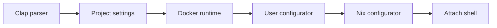

# Architecture

`src/lib.rs` is the composition root. It parses the invocation, resolves project state, runs the Docker lifecycle, configures the user and Nix profile, and attaches when the selected command requires it.

`src/contracts/` defines four boundaries: invocation parsing, environment state storage, environment runtime, and environment configuration. `src/adapters/` implements them with Clap, project settings, Docker, user setup, and Nix. `src/model.rs` contains the values exchanged across those boundaries.

The current flow is:

`remove` skips configuration after removal, `stop` skips lifecycle setup and relies on runtime cleanup, and `update` configures packages without attaching.
